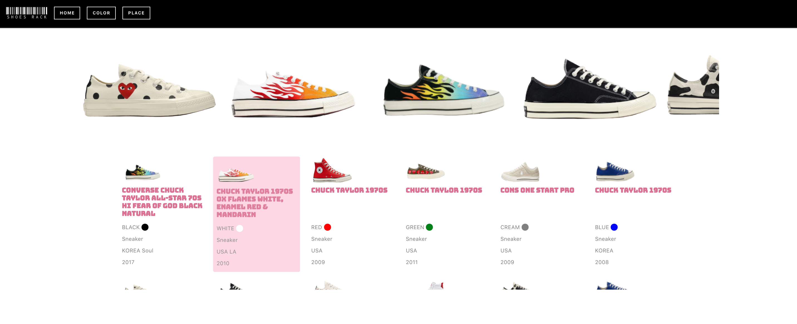

## Description
Welcome to my Shoes Rack ❤️
- This is to store informations of my shoes collections and display!
- To see all shoes collections, click https://shoes-rack.herokuapp.com/  👟 !

## Available Scripts

In the project directory, you can run

### `yarn start`

Runs the app in the development mode. 
Open [http://localhost:3000](http://localhost:3000) to view it in the browser.

### `yarn dev`

Runs react script.

### `yarn build`

Builds the app for production to the `build` folder. 
It correctly bundles React in production mode and optimizes the build for the best performance.

### `yarn knex:migrate:make "your file name"

Create migration file. Migration file will be stored in `/migrations`.

### `yarn knex:migrate:lates`

Runs migrations that migrations folder `/migrations`.

### `yarn knex seed:run`

Seeding data to database.
